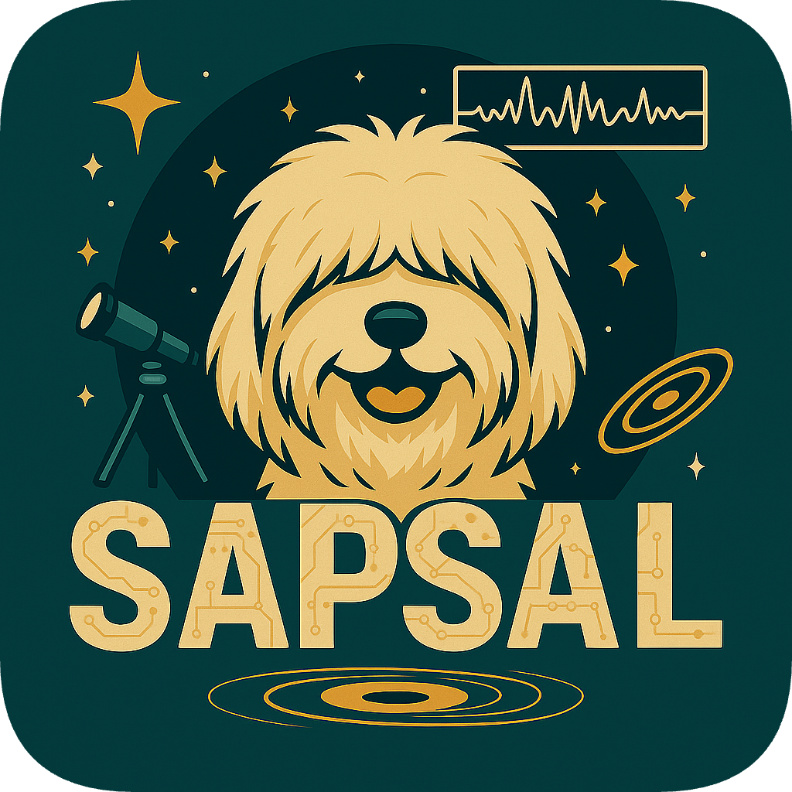

<p align="center">
  
</p>

# SAPSAL

**SAPSAL (Star And Protoplanetary disk Spectroscopic data AnaLyzer with neural networks)** is a deep learning framework for spectral classification of young pre-main sequence stars (M-F types) from their optical spectra. The overall SAPSAL project aims to develop a deep learning tool for analyzing numerous stellar spectra observed by VLT/MUSE (4750 - 9350Å), but from SAPSAL-v3 networks, the usage is not limited to VLT/MUSE data.

The networks are built on the conditional invertible neural networks (cINNs) architecture, which enables getting a full posterior distribution of the parameters, not just a single prediction.

SAPSAL is named after a Korean dog breed, the SAPSAL dog.


This repository provides Python code to build and run the SAPSAL networks introduced in the following papers:
- [Kang et al. 2023](https://www.aanda.org/articles/aa/full_html/2023/06/aa46345-23/aa46345-23.html)
- [Kang et al. 2025](https://www.aanda.org/articles/aa/full_html/2025/05/aa50394-24/aa50394-24.html)
- Kang et al. 2026, _in prep._


## Installation requirements
The following packages are required to run the scripts in this repository:

| Package | Version | Comment |
|---------|---------|---------|
| **Essential** |
| python  | >= 3.11.7   |  
| numpy   |  >= 1.26  | 
| Pytorch | >= 2.2.2  | need torch and torchvision, get [here](https://pytorch.org/) |
| pandas   | >= 2.1.4 |
| astropy | >= 5.3.4 |
| matplotlib | >= 3.8.0 |
| scipy | >= 1.11.4 |
| **Recommended** |
| numba | >= 0.59.0 | Used in hydrogen slab codes (HSlabModel.py). NEEDED when using resimulation for SAPSAL-v3s |
| localreg | >= 0.5.0 | Used in FRAPPE. NEEDED when using resimulation for SAPSAL-v3s, <br> get [here](https://github.com/sigvaldm/localreg) |
| ray | >= 2.44.0  | Used in FRAPPE. NEEDED when using resimulation for SAPSAL-v3s, <br> get [here](https://docs.ray.io/en/latest/index.html#)   <br> ray[default] is enough|
| **Optional** |
| tqdm | >= 4.65.0 | Only required when you train a new network using functions in execute.py |
| GPUtil | >= 1.4.0 | for automatic CUDA GPU search and selection <br> (find_gpu_available function in expander.py), <br> Get [here](https://github.com/anderskm/gputil) |
| KDEpy | >= 1.1.9 | for 1D MAP calcuation <br> (calculate_map function in expander.py), <br> get [here](https://kdepy.readthedocs.io/en/latest/index.html) |
| scikit-learn | >= 1.2.2 | (NOT used for trained network) |
| umap | >= 0.5.7 | (NOT used for trained network) <br> get [here](https://umap-learn.readthedocs.io/en/latest/)  |
> ⚠️ Note: The versions listed are the ones tested with this repository.  
> Earlier versions may also work, but compatibility is not guaranteed.

**FrEIA** package is already included in this repository. The FrEIA used in this repository is based on FrEIA v0.2, but is not perfectly the same as the one in [FrEIA](https://github.com/vislearn/FrEIA).


## How to use pre-trained networks

Once you have cloned the SAPSAL repository, you can load and use the pre-trained networks. 
Below is the list of available SAPSAL networks (2026. 4. 20).


| Network name | Short name | Codename | Parameters to predict | Source | 
|---------|---------|---------|---------|---------|
| SAPSAL-v1-Settl | Settl-Net | v1_Settl | 3 params: $$\rm{log} T_{\rm{eff}}$$, $$\rm{log} g$$, $$A_{\rm{V}}$$ | [Kang et al. 2023](https://www.aanda.org/articles/aa/full_html/2023/06/aa46345-23/aa46345-23.html) |
| SAPSAL-v2-K25   | K25-Net   | v2_K25   | 4 params: $$\rm{log} T_{\rm{eff}}$$, $$\rm{log} g$$, $$A_{\rm{V}}$$, $$r_{\rm{veil}}$$, library flag | [Kang et al. 2025](https://www.aanda.org/articles/aa/full_html/2025/05/aa50394-24/aa50394-24.html) |
| SAPSAL-v3-Vis   | Vis-Net   | v3_Vis   | 9 params: $$\rm{log} T_{\rm{eff}}$$, $$\rm{log} g$$, $$A_{\rm{V}}$$, $$\rm{log} r_{\rm{veil}}$$, library flag, slab parameters ($$T_{\rm{slab}}$$, $$\rm{log} n_{\rm{e}}$$, $$\rm{log} \tau_{0}$$, $$\rm{log} F_{\rm{slab,norm}}$$) | Kang et al. 2026, _in prep._ | 
| SAPSAL-v3-UV    | UV-Net    | v3_UV    | 9 params: $$\rm{log} T_{\rm{eff}}$$, $$\rm{log} g$$, $$A_{\rm{V}}$$, $$\rm{log} r_{\rm{veil}}$$, library flag, slab parameters ($$T_{\rm{slab}}$$, $$\rm{log} n_{\rm{e}}$$, $$\rm{log} \tau_{0}$$, $$\rm{log} F_{\rm{slab,norm}}$$) | Kang et al. 2026, _in prep._ | 

<!--
| Network name | Parameters to predict | Comments |
|---------|---------|---------|
| v1-Settl | Teff, log g, Av (no veiling)  |  cINN trained only on BT-Settl, presented in [Kang et al. 2023](https://www.aanda.org/articles/aa/full_html/2023/06/aa46345-23/aa46345-23.html) <br>Trained on fixed Rv value of 4.4 |
| SpD_TGARL_Noise_mMUSE  |  Teff, log g, Av, r_veil, library flag  | cINN presented in [Kang et al. 2025](https://www.aanda.org/articles/aa/full_html/2025/05/aa50394-24/aa50394-24.html) <br>Trained on BT-Settl and Dusty<br>Trained on fixed Rv value of 4.4|

**SpD_TGARL_Noise_mMUSE** is the recent version used to analyse stars in Trumpler 14. It considers the flux errors in the prediction process (i.e., Noise-Net mode). This network requires MUSE spectrum and medium flux error ($$\sigma_{\rm{med}}$$ = N/S ratio) along the wavelength. More details about the networks are in [Kang et al. 2025](https://www.aanda.org/articles/aa/full_html/2025/05/aa50394-24/aa50394-24.html).

In each network directory, you will find a configuration file (config_XXXX.py) and a zipped network (XXXX.pt.zip). First, unzip the network to get the network file (XXXX.pt). Please keep the configuration file and network file in the same directory (this is not necessary, but it makes reading the network a bit easier).
-->

You can load the network using the corresponding network code (codename in the above table).
```python
import sapsal
print("Network codes available:", sapsal.io.AVAILABLE_NET_CODES)
config = sapsal.io.load_pretrained_network('v3_vis', verbose=True)
```

For more detailed instructions for loading and using the network, see SAPSAL_Tutorial.ipynb in examples/.
This explains:
- how to read the network
- how to prepare input data from your observations
- how to run the network and make predictions
- how to use useful functions in expander.py to calculate MAP estimates, plot posterior distributions, etc.

### Flux points needed for SAPSAL-v3s
| Network name | Wavelength (Å)
|---------|---------|
| Vis-Net | 4770, 5125, 5415, 6010, 6255, 6447.5, 6630, 6825,   <br>  7030, 7070, 7100, 7140, 7200, 7400, 7500, 7560, <br> 7975, 8100, 8575, 8630, 8710 |
| UV-Net | 3400, 3550, 3605, 4005, 4145, 4650, <br> 4750, 5125, 5415, 6255, 6447.5, 6630, 6825, <br> 7030, 7070, 7100, 7140, 7200, 7400, 7500, 7560,  <br> 7975, 8100, 8575, 8630, 8710 |


### MUSE wavelength
SAPSAL-v1 and -v2 networks are designed for the VLT/MUSE spectrum with specific resolution (R~4000) and bin size. We masked some spectral bins in the network to avoid emission lines, but used most of the spectral bins. 
<!-- You can find out how to filter out unnecessary spectral bins in Tutorial.ipynb. -->

MUSE wavelength for the whole range:
> np.arange(4750.1572265625, 9351.4072265625, 1.25)


  


<!--
## 필요한 내용
- 몇가지 훈련된 네트워크 세트 (pt파일, config)
- 훈련된 네트워크 사용방법 알려주는 주피터 노트북: 패키지 경로설정, 클래스 활용 기본, 포스테리어 얻기, MAP-unc 등 계산, 그림그리는 툴
- 임시로 MUSE 스펙트럼 파일 하나 예시. (example directory가 필요)
-->

## Citation
If you use SAPSAL networks in your work, please cite the papers below.
- [Kang et al. 2023](https://www.aanda.org/articles/aa/full_html/2023/06/aa46345-23/aa46345-23.html)
- [Kang et al. 2025](https://www.aanda.org/articles/aa/full_html/2025/05/aa50394-24/aa50394-24.html)
- Kang et al. 2026, _in prep._
- for all networks: [Ardizzone et al. 2019b](https://arxiv.org/abs/1907.02392), [Ardizzone et al. 2021](https://arxiv.org/abs/2105.02104)


## License

This project is licensed under the **MIT License**.

### Third-party Code & Libraries

* **FrEIA library** ([https://github.com/vislearn/FrEIA](https://github.com/vislearn/FrEIA)): 
    * Licensed under the MIT License.
    * Included in this repository as part of the core architecture.
    * **Note:** This project includes a modified version based on FrEIA v0.2. It has been customized for this specific implementation and may differ from the latest upstream version. (See [Installation requirements](#installation-requirements) for details).
 
* **FRAPPE** ([https://github.com/RikClaes/FRAPPE](https://github.com/RikClaes/FRAPPE)):
    * This project incorporates components from the FRAPPE for the resimulation pipeline (specifically for Vis-Net and UV-Net).
    * To ensure compatibility with our trained models, we provide a frozen version based on FRAPPE v0.1 ([https://github.com/RikClaes/FRAPPE_ClassIII_interpolations](https://github.com/RikClaes/FRAPPE_ClassIII_interpolations))
    * **Note on Modifications:** We have included minor modifications (with 1-2 lines) to ensure seamless integration with the SAPSAL environment. 
    * **Credit:s** All rights to the original logic belong to the original author(s). Please cite the original FRAPPE repositories and [Claes et al. 2024](https://ui.adsabs.harvard.edu/abs/2024A%26A...690A.122C/abstract) if you use the resimulation functions for Vis-Net or UV-Net.

<!--
* **Note:** The original code did not have a specific license file at the time of integration (2026.02.09). We have included a slightly modified version (with 1-2 lines of minor modifications). 
## Features

- Conditional Invertible Neural Network (cINN) implementation based on [FrEIA](https://github.com/vislearn/FrEIA)
- Domain adaptation through adversarial training
- Modular model definitions (`models/`)
- Tools for data pre-processing, training, and evaluation

## Folder Structure

It includes code from the FrEIA library (https://github.com/vislearn/FrEIA),  
which is also licensed under the MIT License.


-->

